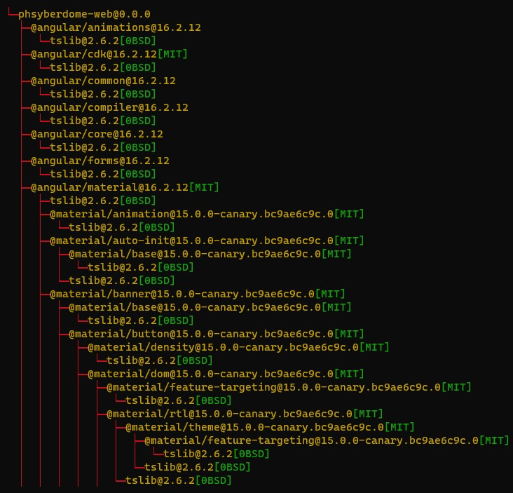

<div align="center">
    
</div>


# Phsyberdome Dependency Scanner And License Detector 

A command line tool to scan the dependencies of a project and detect their Licenses. I wrote this while building an SCA Tool.

The tool scans the metadata file (e.g. pom.xml for maven based projects and package.json for npm) and creates a dependency tree resolving the direct as well as transitive dependencies. The license (if found) is analyzed and matched with the licenses in the SPDX License Database using methods of NLP. The motivation for the algorithm of license detection is taken from [Link](https://github.com/go-enry/go-license-detector).




### Features

- [X] License Detection through License files
- [ ] License Detection through README files (If no License file is found in the package)
- [X] Supports scanning remote public repo
- [X] Supports scanning packages (zip/jar/tgz) 
- [ ] Export report as XML/JSON

### Supported package/project managers

- [X] NPM
- [X] JAVA Maven
- [ ] JAVA Gradle
- [ ] PyPI
- [ ] Rubygems
- [ ] Cargo
- [ ] Go Packages

### Misc

- [ ] Tests


## Build

Go to the module aggregator `dependency-scanner` and build
```
cd dependency-scanner
mvn clean install
```

## Usage

To scan a local project
```
java -jar <path-to-jar> scan -src <project-path>
```

To scan a remote repository/package
```
java -jar <path-to-jar> monitor -src <url>
```

## CONTRIBUTING

Contributions are always welcome. Help me make this software bug free, robust and support more package managers.
Please feel free to raise an issue and discuss. Read the [CONTRIBUTION GUIDELINES](https://github.com/prathamgahlout/phsyberdome-dependency-scanner/blob/master/CONTRIBUTING.md).

